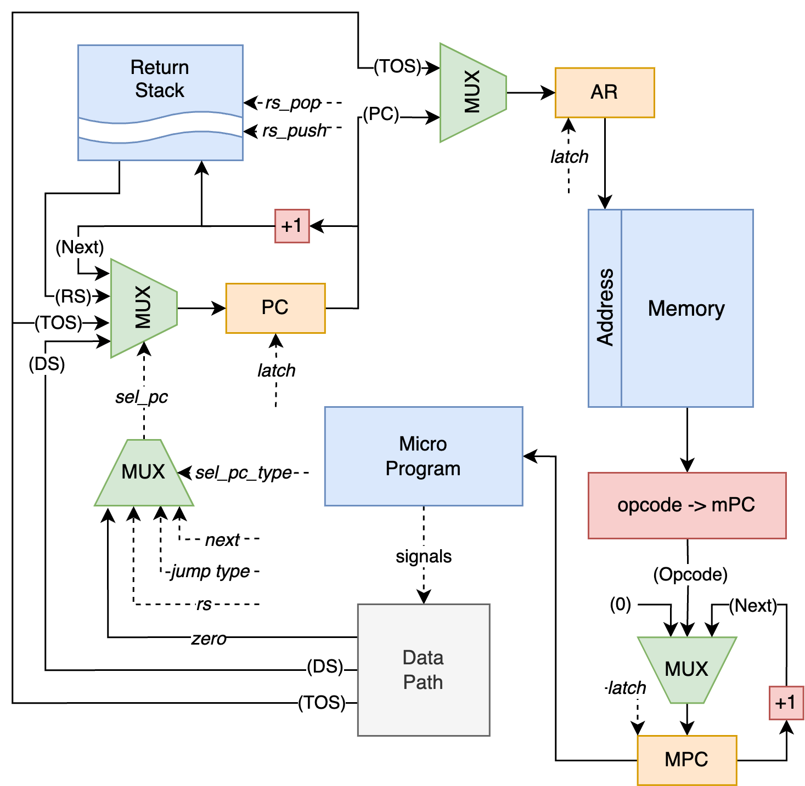

# Архитектура компьютера. Лабораторная работа №3

- Колмаков Дмитрий Владимирович, P3231
- `asm | stack | neum | mc -> hw | instr | 
binary -> struct | stream | port | pstr | prob1 | cache`
- Базовый вариант (без усложнения)


## Содержание

1. [Язык программирования](#язык-программирования)
2. [Организация памяти](#организация-памяти)
3. [Система команд](#система-команд)
4. [Транслятор](#транслятор)
5. [Модель процессора](#модель-процессора)
6. [Тестирование](#тестирование)
7. [Пример использования](#пример-использования)
8. [Пример тестирования исходного кода](#пример-тестирования-исходного-кода)
9. [Статистика](#статистика)


## Язык программирования

### Синтаксис

```ebnf
<program> ::= <section_data>? <section_code>

<section_data> ::= "section data:" <comment>? "\n" <data_line>*
<data_line> ::= <variable> <comment>? "\n"

<variable> ::= <variable_name> ":" <variable_value>
<variable_name> ::= <letter_with_underscore> <letter_or_number_with_underscore>*
<variable_value> ::= <integer>
                   | <string>
                   | <buffer>

<section_code> ::= "section code:" <comment>? "\n" <code_line>*
<code_line> ::= (<label> | <command>) [comment] "\n"

<label> ::= <label_name> ":"
<label_name> ::= <letter_with_underscore> <letter_or_number_with_underscore>*

<command> ::= op0 | op1

<op0> ::= "nop"
        | "pop"
        | "swap"
        | "dup"
        | "over"
        | "inc"
        | "dec"
        | "add"
        | "sub"
        | "mul"
        | "div"
        | "mod"
        | "load"
        | "save"
        | "in"
        | "out"
        | "jmp"
        | "jz"
        | "call"
        | "ret"
        | "halt"

<op1> ::= "push" <integer>
        | "push" <variable_name>
        | "push" <label_name>

<lowercase_letter> ::= [a-z]
<uppercase_letter> ::= [A-Z]
<letter> ::= <lowercase_letter> | <uppercase_letter>
<letter_with_underscore> ::= <letter> | "_"
<letter_or_number_with_underscore> ::= <letter> | <number> | "_"

<number> ::= [0-9]
<integer> ::= "-"? <number>+
<positive_integer> ::= "0"* [1-9] <number>*

<single_quote> ::= "\'"
<double_quote> ::= "\""
<string> ::= <single_quote> [^\"\n]* <single_quote>
           | <double_quote> [^\'\n]* <double_quote>

<buffer> ::= "bf" positive_integer

<comment> ::= ";" [^\n]*
```

### Семантика

- В коде может присутствовать секция данных `data`, в которой могут быть 
  объявлены переменные (числа, строки, буферы). Секция данных обязана 
  находиться до секции кода. Типизация переменных статическая.
- Названия переменных не чувствительны к регистру. Повторное определение
  переменных недопустимо.
- Инициализация буфера производится в секции данных.
  Содержимое буфера по умолчанию `0`.
  ```asm
  buffer:   bf    10    ; буфер размера 10
  ```
- В коде обязана быть секция `code`, в которой могут быть указаны инструкции 
и метки.
- Список доступных инструкций приведен в [системе команд](#система-команд).
- Код выполняется последовательно, одна инструкция за другой.
- Метки определяются на отдельной строке исходного кода:
  ```asm
  start:
      push    1
  ```
  Метки могут быть использованы как до, так и после определения в исходном
  коде. Метки не чувствительны к регистру. Повторное определение меток 
  недопустимо. Названия меток не должны повторять названия переменных.
  Метки имеют глобальную область видимости.
- В коде могут присутствовать подпрограммы. Подпрограммы обязаны завершаться 
  инструкцией `RET`. Аргументы могут передаваться в подпрограмму с помощью 
  `Data Stack`. При этом после завершения подпрограммы в стеке не должно
  оставаться аргументов.


## Организация памяти

- Память соответствует фон Неймановской архитектуре.
- Размер машинного слова - 32 бита.
- Адресация - абсолютная.

```text
            Memory
+------------------------------+
| 00  : start address (n)      |
| 01  : integer value          |
|    ...                       |
| s+0 : string length          |
| s+1 : string value           |
|    ...                       |
| b+0 : buffer (0)             |
| b+1 : buffer (0)             |
|    ...                       |
| n   : program start          |
| n+1 : instruction            |
|    ...                       |
| 7 : PUSH sub                 |
| 8 : CALL                     |
|    ...                       |
| 25  : subprogram instruction |
| 26  : RET                    |
|    ...                       |
|  n  : HALT                   |
+------------------------------+

       Microprogram memory
+------------------------------+
| 00  : signals                |
| 01  : signals                |
|    ...                       |                
+------------------------------+
```

- Ячейка памяти `0` соответствует адресу первой инструкции в секции `code`.
- Если есть секция `data`, то она начинается с ячейки памяти `2`.
  Переменные могут быть трех типов:
  - `Целочисленные` - под них отводится одна ячейка памяти;
  - `Строковые` - под них отводится `n + 1` последовательных ячеек памяти, 
    где `n` - длина строки (дополнительный символ - `n` в начале строки);
  - `Буфферные` - под них отводится `n` последовательных ячеек памяти, где 
    `n` - значение из запроса на выделение памяти (`bf n`);

  Переменные располагаются в памяти в таком порядке, в котором они указаны 
  в исходном коде в секции .data`.
- С ячейки памяти `n` начинаются инструкции, соответствующие исходному коду, 
  прописанному в секции `code`.


## Система команд

### Особенности процессора 

- Машинное слово - 32 бита, знаковое. Абсолютная адресация.
- Присутствуют специальные регистры, недоступные для программиста:
  - `PC (program counter)` - указатель на следующую инструкцию;
  - `MPC (micro program counter)` - указатель на следующую микроинструкцию;
  - `TOS (top of the stack)` - вершина стека;
  - `NOS (near of the stack)` - второй элемент стека;
  - `AR (address register)` - указатель на ячейки памяти;
  - `BR (buffer register)` - регистр для промежуточного хранения значений 
    из стека.
- Обработка данных:
  - Арифметические операции над данными из стека;
  - Операции над стеком;
  - Операции ввода/вывода;
  - Операции чтения/записи с памятью.
- Доступ к памяти осуществляется по адресу из регистра `AR`. Значение в нем 
  может быть защелкнуто либо из `PC`, либо из `TOS`.
- Ввод/вывод реализован с помощью внешних устройств ввода/вывода и
  контроллера ввода/вывода.
  - Устройства подключаются к контроллеру и доступны по номеру порта. 
  - Адресация абсолютная, ограничена машинным словом.
  - По умолчанию доступно одно устройство с адресом `1`;
  - Входные и выходные данные представлены в виде потока токенов.
- Поток управления:
  - Значение `PC` увеличивается после каждой инструкции:
    - После инструкций без аргумента - на 1;
    - После инструкций с аргументом (`PUSH`) - на 2.
  - Безусловный переход - `JMP`, `CALL`, `RET`;
  - Условный переход - `JZ`, если на вершине стека ноль;
  - `HАLT` - остановка программы.

### Набор инструкций

#### Операции над стеком

- `PUSH integer` - положить на вершину стека данных целочисленное значение;
- `PUSH variable` - положить на вершину стека данных адрес, с которого 
  начинается переменная;
- `PUSH label` - положить на вершину стека данных адрес, на который 
  указывает метка;
- `POP` - удалить значение с вершины стека данных `[a] -> []`;
- `SWAP` - поменять местами два значения на вершине стека данных
  `[a, b] -> [b, a]`;
- `DUP` - продублировать вершину стека данных `[a] -> [a, a]`;
- `OVER` - дублировать первый элемент на стеке данных через второй 
  `[a, b] -> [b, a, b]`.

#### Арифметические операции

- `INC` - увеличить значения на вершине стека данных на 1 `[a] -> [a + 1]`;
- `DEC` - уменьшить значения на вершине стека данных на 1 `[a] -> [a - 1]`;
- `ADD` - сумма двух значений на вершине стека данных `[a, b] -> [b + a]`;
- `SUB` - разность двух значений на вершине стека данных (из верхнего 
  вычитается второе) `[a, b] -> [b - a]`;
- `MUL` - произведение двух значений на вершине стека данных 
  `[a, b] -> [b * a]`;
- `DIV` - целочисленное деление двух значений на вершине стека данных
  (верхнее делится на второе) `[a, b] -> [b // a]`;
- `MOD` - остаток от деления двух значений на вершине стека данных (верхнее 
  делится на второе) `[a, b] -> [b % a]`.

#### Операции с памятью

- `LOAD` - загрузить из памяти значение по адресу с вершины стека 
  `[address] -> [value_from_memory]`;
- `SAVE` - взять адрес с вершины стека данных и записать в память значение, 
  следующее после вершины стека данных `[value, address] -> []`.

#### Операции ввода/вывода

- `IN` – получить данные из внешнего устройства по указанному порту
  `[port] -> [value]`;
- `OUT` – отправить данные во внешнее устройство по указанному порту
  `[value, port] -> []`.

#### Операции потока программы

- `NOP` - нет операции;
- `JMP` - переход по адресу из вершины стека данных `[address] -> []`;
- `JZ` - переход на указанную метку при условии, что флаг `zero (Z)` равен 1,
  иначе - переход к следующей по порядку команде `[address] -> []`;
- `CALL` - вызов подпрограммы по адресу из вершины стека `[address] -> []`;
- `RET` - возврат из вызванной подпрограммы в основную программу на 
  следующий адрес;
- `HALT` - остановка тактового генератора.

### Способ кодирования инструкций
Инструкции имеют бинарное представление и состоят только из опкода 
длиною 5 бит. Соответствие между инструкцией и ее опкодом можно найти 
в модуле [isa](./isa.py).

Таким образом, единственный способ непосредственного ввода данных на 
стек – операция `PUSH <argument>`. Все остальные операции взаимодействуют 
только со стеком и берут аргументы со стека.

Также особенность инструкции `PUSH` заключается в том, что
ее операнд лежит в следующей ячейке памяти.
Например, команда `PUSH 42` будет представлена в виде:

```text
n	0000 0000 0000 0000 0000 0000 0000 0001		push
n+1	0000 0000 0000 0000 0000 0000 0010 1010		42
```

По этой причине PC после команды `PUSH` увеличивается на 2.


## Транслятор

### Интерфейс командной строки

```commandline
usage: translator.py [-h] source_file target_file

ASM code translator

positional arguments:
  source_file  Source file name
  target_file  Target file name

options:
  -h, --help   show this help message and exit
```

Реализован в модуле [translator](./translator.py).

### Этапы трансляции

Трансляция реализуется в несколько этапов:

1. Генерация машинного кода без адресов меток и переменных,
   расчёт адресов меток и переменных;
2. Подстановка адресов меток и переменных в инструкции;
3. Генерация бинарного файла `<target_file>`;
4. Генерация текстового файла `<target_file>_com.txt` с комментариями.


## Модель процессора

### Интерфейс командной строки

```commandline
usage: main.py [-h] [-l LIMIT] [-c] [-d] code_file [input_file]

Stack processor simulation

positional arguments:
  code_file             Binary code file name
  input_file            Input file name (optional)

options:
  -h, --help            show this help message and exit
  -l LIMIT, --limit LIMIT
                        Tick limit (default - 200000)
  -c, --char            Char output (default - list[int])
  -d, --debug           Debug logging (default - info)
```

Реализован в модуле [main](./main.py).

### DataPath


Реализован в модуле [data_path](./data_path.py).

- `Memory` - однопортовая память;
- `ALU` - АЛУ для выполнения арифметических операций;
- `Data Stack` - стек данных;
- `TOS` - вершина стека;
- `Address Register` - указатель на ячейки памяти;
- `Buffer Register` - для промежуточных операций со стеком;
- `IO Controller` - контроллер ввода/вывода.

Управляющие сигналы приходят из памяти микрокоманд, описаны 
в модуле [uarch](./uarch.py).

- `DS_PUSH` - защелкнуть вершину стека данных во второй элемент стека данных;
- `DS_POP` - убрать второй элемент из стека данных;
- `LATCH_TOS` - защелкнуть выбранное значение в вершину стека данных:
  - `SEL_TOS_DS` - защелкнуть значение второго элемента стека данных;
  - `SEL_TOS_MEMORY` - защелкнуть значение из памяти;
  - `SEL_TOS_INPUT` - защелкнуть значение из IO контроллера;
  - `SEL_TOS_ALU` - защелкнуть значение из АЛУ;
  - `SEL_TOS_BR` - защелкнуть значение из буферного регистра;
- `LATCH_AR` - защелкнуть выбранное значение в адресный регистр:
  - `SEL_AR_TOS` - защелкнуть значение из вершины стека данных;
  - `SEL_AR_PC` - защелкнуть значение из счетчика команд;
- `LATCH_BR` - защелкнуть значение второго элемента стека данных 
  в буферный регистр;
- `ALU_SUM`, `ALU_SUB`, `ALU_MUL`, `ALU_DIV`, `ALU_MOD` - выбор 
  соответствующей арифметической операции на АЛУ;
- `ALU_INC`, `ALU_DEC` - модификация результата АЛУ;
- `ALU_RIGHT_OP_NOS` - подача второго элемента стека данных на правый вход АЛУ;
- `ALU_RIGHT_OP_ZERO` - подача нуля на правый вход АЛУ;
- `OUT` - отправить второй элемент стека данных на внешнее устройство по
  порту, указанному в вершине стека данных;
- `WRITE` - записать в память по адресу из AR второй элемент стека данных.

Флаги:
- `zero (Z)` - проверка вершины стека на ноль.

### ControlUnit



Реализован в модуле [control_unit](./control_unit.py).
Микрокод находится в модуле [uarch](./uarch.py).

- `Program Counter` - счетчик команд;
- `Micro Program Counter` - счетчик микрокоманд;
- `Micro Program` - память микрокоманд;
- `Return Stack` - стек возврата;

Управляющие сигналы приходят из памяти микрокоманд, описаны 
в модуле [uarch](./uarch.py).

- `RS_PUSH` - защелкнуть в стеке возврата инкрементированное значение
  счетчика команд;
- `RS_POP` - убрать элемент из стека возврата;
- `LATCH_PC` - защелкнуть выбранное значение в счетчик команд:
  - `SEL_PC_NEXT` - защелкнуть инкрементированное значение счетчика команд;
  - `SEL_PC_JMP` - защелкнуть значение из вершины стека данных;
  - `SEL_PC_JZ` - защелкнуть значение из второго элемента стека данных если 
    флаг `zero (Z)` равен 1, иначе защелкнуть инкрементированное значение 
    из счетчика команд;
  - `SEL_PC_RS` - защелкнуть значение из вершины стека возврата;
- `LATCH_MPC` - защелкнуть выбранное значение в счетчик микрокоманд:
  - `SEL_MPC_ZERO` - защелкнуть ноль:
  - `SEL_MPC_OPCODE` - защелкнуть значение из памяти по адресу из AR;
  - `SEL_MPC_NEXT` - защелкнуть инкрементированное значение из 
    счетчика микрокоманд;
- `HALT` - остановка тактового генератора.


## Тестирование

- Тестирование осуществляется при помощи golden test-ов.
- Настройки golden тестирования находятся в [файле golden_test.py](./golden_test.py)
- Конфигурация golden test-ов лежит в [директории golden](./golden)

Тестовое покрытие:
- `cat` – повторяет поток ввода на вывод;
- `hello_username` – печатает на выход приветствие пользователя;
- `hello_world` – печатает на выход “Hello, world!”;
- `math` – арифметические действия;
- `prob1` – сумма чисел от 1 до 1000, кратные 3 либо 5.

Запустить тесты: 
```shell
poetry run pytest . -v
```

Обновить конфигурацию golden-тестов: 
```shell
poetry run pytest . -v --update-goldens
```

### CI

CI при помощи Github Actions настроен в [файле ci.yml](./.github/workflows/ci.yml):

```yaml
name: stack-machine

on: [push]

jobs:
  golden:
    runs-on: ubuntu-latest

    steps:
      - name: Checkout code
        uses: actions/checkout@v4

      - name: Set up Python
        uses: actions/setup-python@v4
        with:
          python-version: 3.12

      - name: Install dependencies
        run: |
          python3 -m pip install --upgrade pip
          pip3 install poetry
          poetry install

      - name: Run tests and collect coverage
        run: |
          poetry run coverage run -m pytest .
          poetry run coverage report -m
        env:
          CI: true

  ruff:
    runs-on: ubuntu-latest

    steps:
      - name: Checkout code
        uses: actions/checkout@v4

      - name: Set up Python
        uses: actions/setup-python@v4
        with:
          python-version: 3.12

      - name: Install dependencies
        run: |
          python3 -m pip install --upgrade pip
          pip3 install poetry
          poetry install

      - name: Check code formatting with Ruff
        run: |
          poetry run ruff format --check . --exclude uarch.py

      - name: Run Ruff linters
        run: |
          poetry run ruff check .

  mypy:
    runs-on: ubuntu-latest

    steps:
      - name: Checkout code
        uses: actions/checkout@v4

      - name: Set up Python
        uses: actions/setup-python@v4
        with:
          python-version: 3.12

      - name: Install dependencies
        run: |
          python3 -m pip install --upgrade pip
          pip3 install poetry
          poetry install

      - name: Check static typing with mypy
        run: |
          poetry run mypy .
```

Использованы следующие команды:

- `poetry` - управления зависимостями Python;
- `coverage` - формирование отчёта об уровне покрытия исходного кода;
- `pytest` - программа для запуска тестов;
- `ruff` - линтер и форматтер;
- `mypy` - проверка статической типизации

Тестовые процессы:

- `golden` - запуск golden-тестов
- `ruff` - запуск линтера и проверки форматирования `ruff`
- `mypy` - запуск проверки статической типизации `mypy`

### Пример использования

Запуск транслятора:
```shell
python3 translator.py asm/hello_world.asm asm/hello_world.bin
```

Вывод транслятора:
```commandline
Translation successful
Source LoC: 43, Number of Instructions: 50
```

Мнемоники:
```commandline
0	0000 0000 0000 0000 0000 0000 0001 0000 	start_address = 16
1	0000 0000 0000 0000 0000 0000 0000 0001 	port = 1
2	0000 0000 0000 0000 0000 0000 0000 1101 	hello : 13
3	0000 0000 0000 0000 0000 0000 0100 1000 	       `H`
4	0000 0000 0000 0000 0000 0000 0110 0101 	       `e`
5	0000 0000 0000 0000 0000 0000 0110 1100 	       `l`
6	0000 0000 0000 0000 0000 0000 0110 1100 	       `l`
7	0000 0000 0000 0000 0000 0000 0110 1111 	       `o`
8	0000 0000 0000 0000 0000 0000 0010 1100 	       `,`
9	0000 0000 0000 0000 0000 0000 0010 0000 	       ` `
10	0000 0000 0000 0000 0000 0000 0111 0111 	       `w`
11	0000 0000 0000 0000 0000 0000 0110 1111 	       `o`
12	0000 0000 0000 0000 0000 0000 0111 0010 	       `r`
13	0000 0000 0000 0000 0000 0000 0110 1100 	       `l`
14	0000 0000 0000 0000 0000 0000 0110 0100 	       `d`
15	0000 0000 0000 0000 0000 0000 0010 0001 	       `!`
16	0000 0000 0000 0000 0000 0000 0000 0001 	PUSH
17	0000 0000 0000 0000 0000 0000 0000 0010 	hello (2)
18	0000 0000 0000 0000 0000 0000 0000 1101 	LOAD
19	0000 0000 0000 0000 0000 0000 0000 0100 	DUP
20	0000 0000 0000 0000 0000 0000 0000 0001 	PUSH
21	0000 0000 0000 0000 0000 0000 0000 0001 	port (1)
22	0000 0000 0000 0000 0000 0000 0000 1101 	LOAD
23	0000 0000 0000 0000 0000 0000 0001 0000 	OUT
24	0000 0000 0000 0000 0000 0000 0000 0100 	DUP
25	0000 0000 0000 0000 0000 0000 0000 0001 	PUSH
26	0000 0000 0000 0000 0000 0000 0011 0001 	break (49)
27	0000 0000 0000 0000 0000 0000 0000 0011 	SWAP
28	0000 0000 0000 0000 0000 0000 0001 0010 	JZ
29	0000 0000 0000 0000 0000 0000 0000 0001 	PUSH
30	0000 0000 0000 0000 0000 0000 0000 0010 	hello (2)
31	0000 0000 0000 0000 0000 0000 0000 0110 	INC
32	0000 0000 0000 0000 0000 0000 0000 0100 	DUP
33	0000 0000 0000 0000 0000 0000 0000 1101 	LOAD
34	0000 0000 0000 0000 0000 0000 0000 0001 	PUSH
35	0000 0000 0000 0000 0000 0000 0000 0001 	port (1)
36	0000 0000 0000 0000 0000 0000 0000 1101 	LOAD
37	0000 0000 0000 0000 0000 0000 0001 0000 	OUT
38	0000 0000 0000 0000 0000 0000 0000 0011 	SWAP
39	0000 0000 0000 0000 0000 0000 0000 0111 	DEC
40	0000 0000 0000 0000 0000 0000 0000 0100 	DUP
41	0000 0000 0000 0000 0000 0000 0000 0001 	PUSH
42	0000 0000 0000 0000 0000 0000 0011 0001 	break (49)
43	0000 0000 0000 0000 0000 0000 0000 0011 	SWAP
44	0000 0000 0000 0000 0000 0000 0001 0010 	JZ
45	0000 0000 0000 0000 0000 0000 0000 0011 	SWAP
46	0000 0000 0000 0000 0000 0000 0000 0001 	PUSH
47	0000 0000 0000 0000 0000 0000 0001 1111 	loop (31)
48	0000 0000 0000 0000 0000 0000 0001 0001 	JMP
49	0000 0000 0000 0000 0000 0000 0001 1111 	HALT
```

Запуск процессора:
```shell
python3 main.py asm/hello_world.bin -c
```

Вывод процессора (логирование уровня INFO):
```commandline
Output: Hello, world!
Ticks: 948, Instructions: 204
```

Часть [журнала работы](./asm/hello_world_out.txt) (логирование уровня DEBUG):
```commandline
DEBUG:root:
Tick: 0
MicroInstruction: LATCH_MPC, SEL_MPC_OPCODE
Instruction: PUSH 2
PC	MPC	AR	BR	TOS
16	1	16	0	0
DS: []
RS: []

DEBUG:root:
Tick: 1
MicroInstruction: DS_PUSH, LATCH_PC, SEL_PC_NEXT, LATCH_MPC, SEL_MPC_NEXT
PC	MPC	AR	BR	TOS
16	3	16	0	0
DS: []
RS: []

DEBUG:root:
Tick: 2
MicroInstruction: LATCH_AR, SEL_AR_PC, LATCH_MPC, SEL_MPC_NEXT
PC	MPC	AR	BR	TOS
17	4	16	0	0
DS: [0]
RS: []

DEBUG:root:
Tick: 3
MicroInstruction: LATCH_TOS, SEL_TOS_MEMORY, LATCH_PC, SEL_PC_NEXT, LATCH_MPC, SEL_MPC_ZERO
PC	MPC	AR	BR	TOS
17	5	17	0	0
DS: [0]
RS: []

DEBUG:root:
Tick: 4
MicroInstruction: LATCH_AR, SEL_AR_PC, LATCH_MPC, SEL_MPC_NEXT
PC	MPC	AR	BR	TOS
18	0	17	0	2
DS: [0]
RS: []
```

### Пример тестирования исходного кода
```commandline
================================ test session starts ================================
platform darwin -- Python 3.12.3, pytest-8.2.1, pluggy-1.5.0 -- /Users/whatever125/De
sktop/ак/lab3/.venv/bin/python
cachedir: .pytest_cache
rootdir: /Users/whatever125/Desktop/ак/lab3
configfile: pyproject.toml
plugins: golden-0.2.2
collected 5 items                                                                   

golden_test.py::test_translator_and_machine[golden/hello_username.yml] PASSED [ 20%]
golden_test.py::test_translator_and_machine[golden/prob1.yml] PASSED          [ 40%]
golden_test.py::test_translator_and_machine[golden/math.yml] PASSED           [ 60%]
golden_test.py::test_translator_and_machine[golden/cat.yml] PASSED            [ 80%]
golden_test.py::test_translator_and_machine[golden/hello_world.yml] PASSED    [100%]

================================= 5 passed in 0.42s =================================
```

### Статистика
```text
| ФИО                           | алг            | LoC | code инстр. | инстр. | такт.  |
+-------------------------------+----------------+-----+-------------+--------+--------+
| Колмаков Дмитрий Владимирович | cat            | 39  | 34          | 179    | 822    |
| Колмаков Дмитрий Владимирович | hello_username | 100 | 158         | 686    | 3240   |
| Колмаков Дмитрий Владимирович | hello_world    | 43  | 50          | 204    | 948    |
| Колмаков Дмитрий Владимирович | math           | 19  | 16          | 9      | 37     |
| Колмаков Дмитрий Владимирович | prob1          | 55  | 53          | 22523  | 108079 |
```
